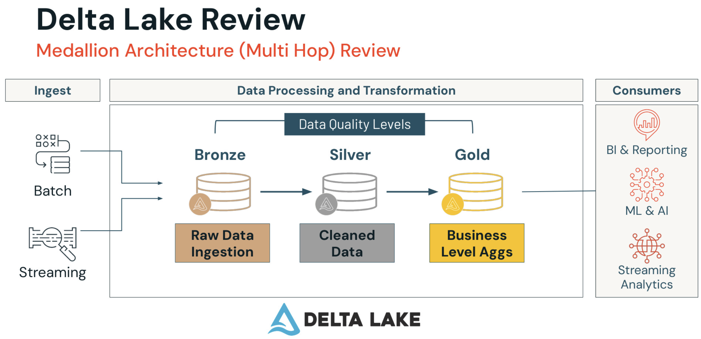
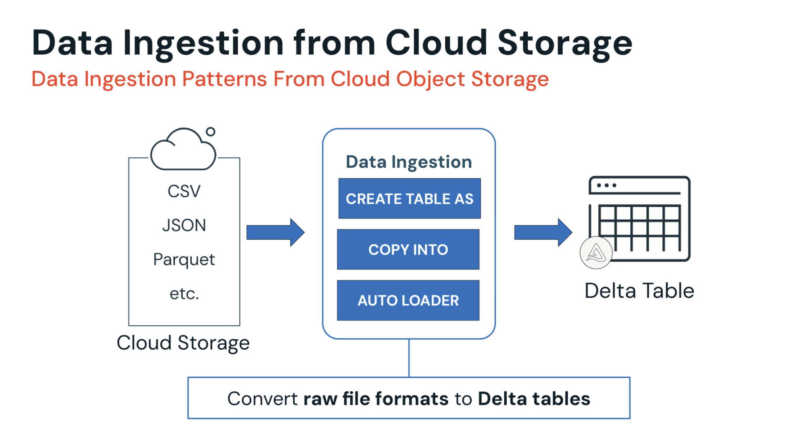
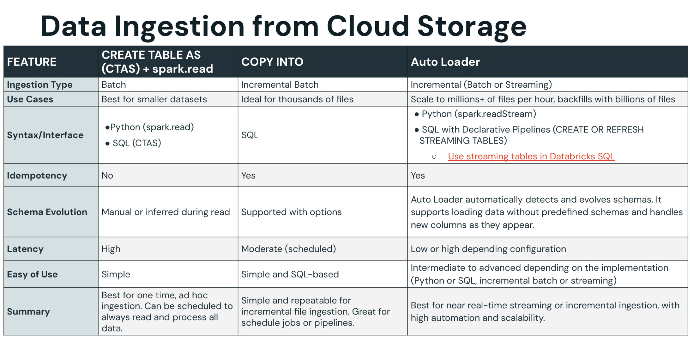

# Data Ingestion with Lakeflow Connect

## General Architecture


## What is Lakeflow Connect?

Bunch of connectors to ingest data into the Databricks Lakehouse from different sources: enterprises, cloud storage,
databases, local files, message buses, etc.

## What is Medallion Architecture?

The goal is to progressively improve the structure and quality of data in the Lakehouse through bronze, silver, and gold
layers:

_Bronze:_ raw data ingestion layer "as is"
_Silver:_ clean, transform and enrich data
_Gold:_ high-quality data optimized for analytics

## What is Delta Lake?

Key concept: **delta tables**. They store data within folder directories (parquet files) and add delta logs to track
changes. With logs, we have the concept of table states, where all changes are being tracked, so we can easily revert to
previous versions of the data.
Delta Lake manages any data ingested into the Databricks Lakehouse regardless of the ingestion method.



## Connector types

### Manual File Uploads

Upload local files to the Databricks Lakehouse into either in volume or as a table.

### Standard Connector

Data ingestion from various sources: cloud storage, Kafka, etc.

**Ingestion modes:**

- `BATCH`: all data is reingested every time the pipeline runs
- `INCREMENTAL BATCH`: only new data is ingested
- `STREAMING`: continuously load data rows as it is generated, so you can query the data as it arrives in near real
  time.

### Managed Connector

Ingesting data from enterprises sources: SaaS, databases, etc.

## Data Ingestion

### Data Ingestion from Cloud Storage



#### Data Formats

- Parquet
- CSV
- JSON
- etc.

#### Methods

1. `CREATE TABLE AS` (**batch**): creates a Delta table by default from a file or files.

    ```sql
    CREATE TABLE new_table AS SELECT * FROM read_files(<path_to_file(s)>, format = <'file_type'>, <other_format_specific_options>)
    ```

    ```python
   spark.read.load()
   ```

2. `COPY INTO` (**incremental batch**): creates an empty Delta table to copy data into. It skips files that have already
   been loaded, so it is retriable and idempotent. **Ideal if:** cloud storage location is continuously adding files.

    ```sql
    CREATE TABLE new_table;
    COPY INTO new_table FROM '<dir_path>'
    FILE_FORMAT = <file_type>
    FORMAT_OPTIONS(<ooptions>)
    COPY_OPTIONS(<ooptions>)
    ```

3. `AUTO LOADER` (**incremental batch or streaming**): processes new files in either a batch or streaming manner as they
   arrive in cloud storage.
   **Ideal if:** billion of files in cloud storage, so it is built to scale.

    ```sql
   -- Auto Loader: STREAM + read_files()
    CREATE OR REFRESH STREAMING TABLE catalog.schema.table
    SCHEDULE EVERY 1 HOUR AS
    SELECT * FROM STREAM read_files('<dir_path>', format => <'file_type'>)
    ```

    ```python
   (spark.
   readStream
   .format("cloudFiles")
   .option("cloudFiles.format", "json")
   .option("cloudFiles.schemaLocation", "<checkpoint_path>")
   .load("/Volumes/catalog/schema/files")
   .writeStream
   .option("checkpointLocation", "<checkpoint_path>")
   .trigger(processingTime = "1 hour")
   .toTable("catalog.database.table")
   )
   ```

Databricks recommends using the `AUTO LOADER` with _Lakeflow Decxlarative Pipelines_ with SQL over `COPY INTO` method
for streaming or incremental batch ingestion.



#### Metadata Columns

#### Rescued Data Columns

#### Ingesting JSON Data

### Data Ingestion from Enterprise Sources (SaaS, databases)