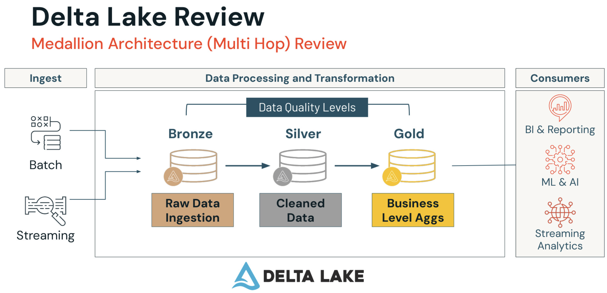
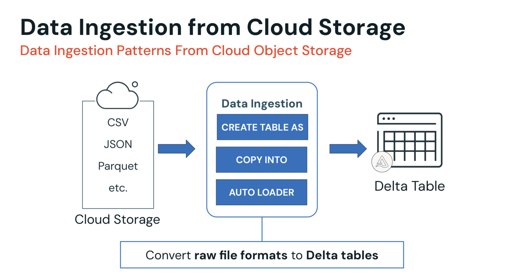
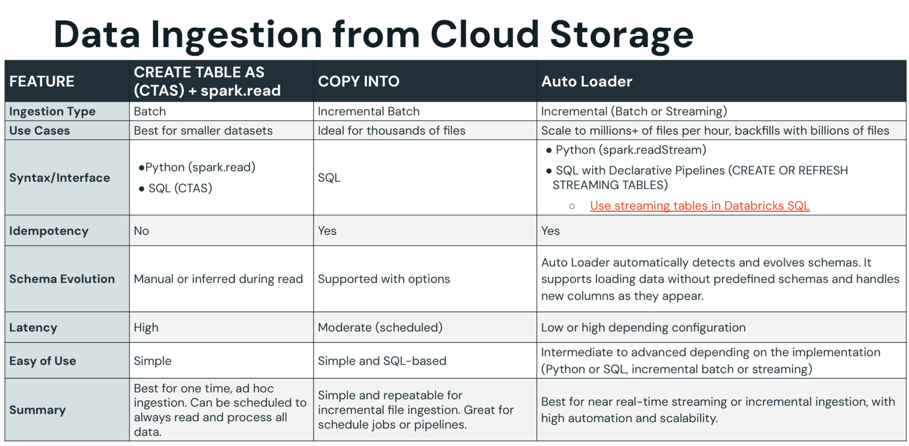
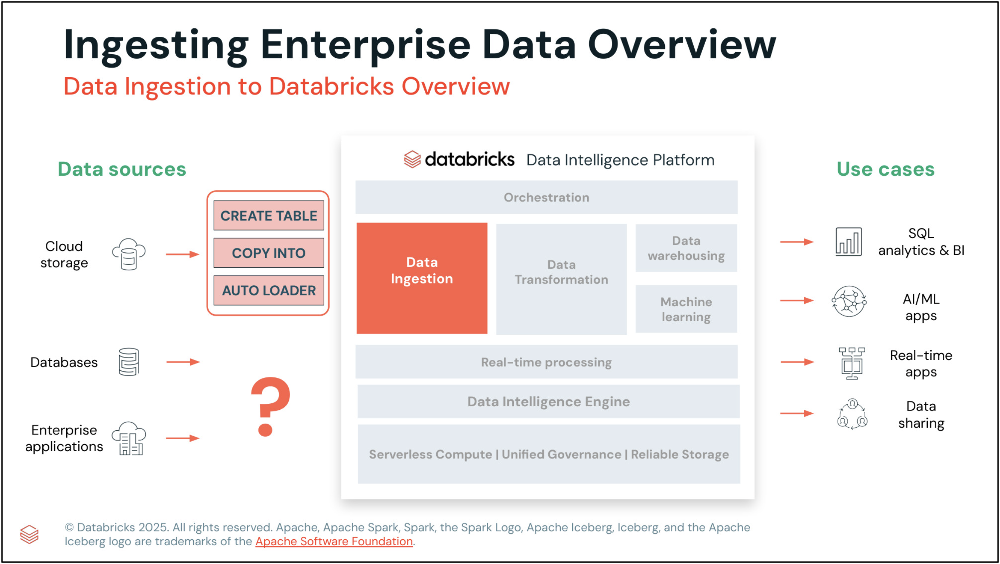

# Data Ingestion with Lakeflow Connect

## What is Lakeflow Connect?

Bunch of connectors to ingest data into the Databricks Lakehouse from different sources: enterprises, cloud storage,
databases, local files, message buses, etc.

## What is Medallion Architecture?

The goal is to progressively improve the structure and quality of data in the Lakehouse through bronze, silver, and gold
layers:

_Bronze:_ raw data ingestion layer "as is"
_Silver:_ clean, transform and enrich data
_Gold:_ high-quality data optimized for analytics

## What is Delta Lake?

Key concept: **delta tables**. They store data within folder directories (parquet files) and add delta logs to track
changes. With logs, we have the concept of table states, where all changes are being tracked, so we can easily revert to
previous versions of the data.
Delta Lake manages any data ingested into the Databricks Lakehouse regardless of the ingestion method.



## Connector types

### Manual File Uploads

Upload local files to the Databricks Lakehouse into either in volume or as a table.

### Standard Connector

Data ingestion from various sources: cloud storage, Kafka, etc.

**Ingestion modes:**

- `BATCH`: all data is reingested every time the pipeline runs
- `INCREMENTAL BATCH`: only new data is ingested
- `STREAMING`: continuously load data rows as it is generated, so you can query the data as it arrives in near real
  time.

### Managed Connector

Ingesting data from enterprises sources: SaaS, databases, etc.

## Data Ingestion

### Data Ingestion from Cloud Storage



#### Data Formats

- Parquet
- CSV
- JSON
- etc.

#### Methods

1. `CREATE TABLE AS` (**batch**): creates a Delta table by default from a file or files.

    ```sql
    CREATE TABLE new_table AS SELECT * FROM read_files(<path_to_file(s)>, format = <'file_type'>, <other_format_specific_options>)
    ```

    ```python
   spark.read.format("csv").option("header", True).load("/Volumes/<catalog>/<schema>/<volume>/<path>")
   ```

2. `COPY INTO` (**incremental batch**): loads files into an existing Delta table. Tracks loaded files in the table's
   commit log so it is retriable and idempotent. **Ideal if:** cloud storage location is continuously adding files.

    ```sql
    -- target must exist with a schema (or use mergeSchema=true on a column-less table)
    CREATE TABLE new_table (id BIGINT, amount DOUBLE) USING DELTA;

    COPY INTO new_table FROM '<dir_path>'
    FILEFORMAT = <file_type>
    FORMAT_OPTIONS(<options>)
    COPY_OPTIONS(<options>)
    ```

3. `AUTO LOADER` (**incremental batch or streaming**): processes new files in either a batch or streaming manner as they
   arrive in cloud storage.
   **Ideal if:** billions of files in cloud storage, so it is built to scale.
   **Note:** each file is read **exactly once** (tracked by path in the checkpoint) — later overwrites/modifications of
   an already-ingested file are ignored unless `cloudFiles.allowOverwrites = true` is set.
   See `learn_deep_dive.md` §3 for caveats.

    ```sql
   -- Auto Loader as a scheduled streaming table (serverless SQL — outside Spark Declarative Pipelines)
    CREATE OR REFRESH STREAMING TABLE catalog.schema.table
    SCHEDULE EVERY 1 HOUR AS
    SELECT * FROM STREAM read_files('<dir_path>', format => <'file_type'>)
    -- Inside a Spark Declarative Pipeline you omit SCHEDULE; the pipeline's trigger config controls it.
    ```

    ```python
   (spark.
   readStream
   .format("cloudFiles")
   .option("cloudFiles.format", "json")
   .option("cloudFiles.schemaLocation", "<schema_path>")     # schema versions live here
   .load("/Volumes/catalog/schema/files")
   .writeStream
   .option("checkpointLocation", "<checkpoint_path>")        # may be the SAME path as schemaLocation (schemas go into a _schemas/ subdir)
   .trigger(processingTime = "1 hour")
   .toTable("catalog.database.table")
   )
   ```

Databricks recommends using the `AUTO LOADER` with _Lakeflow Spark Declarative Pipelines_ with SQL over `COPY INTO`
method for streaming or incremental batch ingestion.



#### Metadata Columns

Hidden `_metadata` struct on file sources: `_metadata.file_path`, `_metadata.file_name`, `_metadata.file_size`,
`_metadata.file_modification_time`, `_metadata.file_block_start`, `_metadata.file_block_length`.
See `learn_deep_dive.md` §3 for usage.

#### Rescued Data Column

Auto Loader adds `_rescued_data` (STRING containing JSON) by default when the schema is **inferred**; with an explicit
schema you must opt in via the `rescuedDataColumn` option. Captures fields missing from the schema, type
mismatches, and case mismatches so no data is silently lost. To get rid of it, drop the column with `.drop()`
or provide an explicit schema without opting in.
See `learn_deep_dive.md` §3 for evolution-mode interaction.

#### Ingesting JSON Data

Schema-on-read via Auto Loader (untyped columns default to STRING — pin types with `cloudFiles.schemaHints`).
Parse stringified JSON columns later with `from_json(payload, schema)`. For highly variable JSON use the **VARIANT**
type (DBR 15.3+). Full coverage with examples in `learn_deep_dive.md` §5.

### Data Ingestion from Enterprise Sources (SaaS, databases)



- Uses **serverless Spark Declarative Pipelines** to collect credentials from Unity Catalog and to reach data sources
- Data is stored in streaming Delta tables
- Architecture:
    - **Ingestion gateway:** collects credentials from Unity Catalog and connects to databases. Limits the number of
      direct connections to the database and can be installed inside the network to avoid firewall issues
    - **Unity Catalog volume:** intermediate staging layer enabling pipelines to pick up and stream data
    - **Managed ingestion pipeline:** collects data and stores it in streaming Delta tables

### One connector per source category — there is no "unified connector"

Connectors are specialized by source type; each source gets its **own connection** (a UC securable
holding the auth details) and its **own ingestion pipeline**
([official overview](https://docs.databricks.com/aws/en/ingestion/lakeflow-connect/)). A scenario with
Salesforce + SQL Server + Kafka + ADLS therefore means **separate connectors/pipelines per source**,
not one generic connector — a popular invented distractor.

Component difference inside the managed family (exam angle):

| Connector | Components |
| --- | --- |
| **SaaS** (Salesforce, Workday, …) | connection + ingestion pipeline + destination tables |
| **Database CDC** (SQL Server, MySQL, PostgreSQL, …) | the same **plus ingestion gateway + staging storage** (gateway pulls UC credentials, limits DB connections) |

Standard connectors (cloud object storage via Auto Loader, event buses like Kafka) stay outside this
architecture — they are configured directly on the stream/pipeline.

### Partner Connect (separate concept)

A marketplace of **third-party connectors** for sources without a native Lakeflow Connect connector. Sits between
your data source and the lakehouse and lets you use Lakeflow Connect-style ingestion with sources Databricks doesn't
support directly. Not part of the managed-connector architecture above — a separate option in the connector decision.

## Additional Features

- **Lakehouse Federation:** allows querying external data sources without moving data to the Databricks Lakehouse.
  Useful for POC and testing purposes
- **Zerobus:** allows writing event data to the lakehouse with high throughput and low latency
- **Delta sharing:** allows sharing data across platforms, clouds and regions
- **Databricks marketplace:** allows open exchange for all data products like datasets, notebooks, ML models, etc.